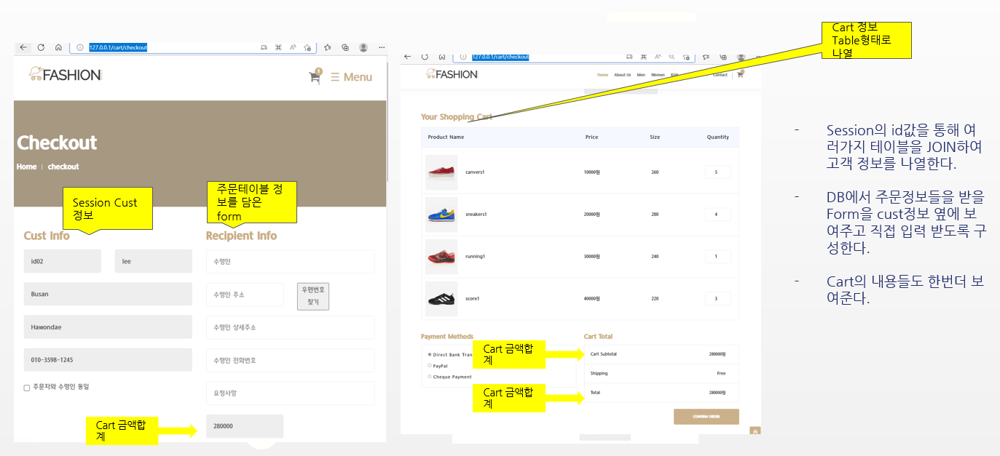
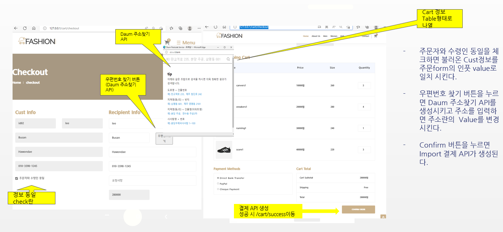
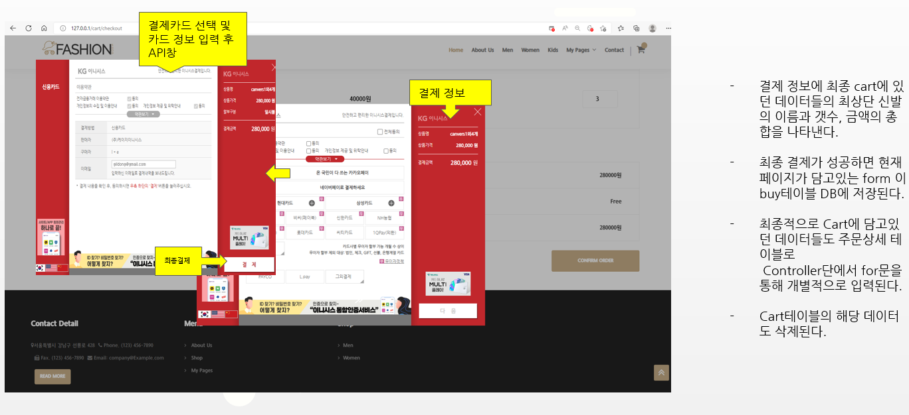
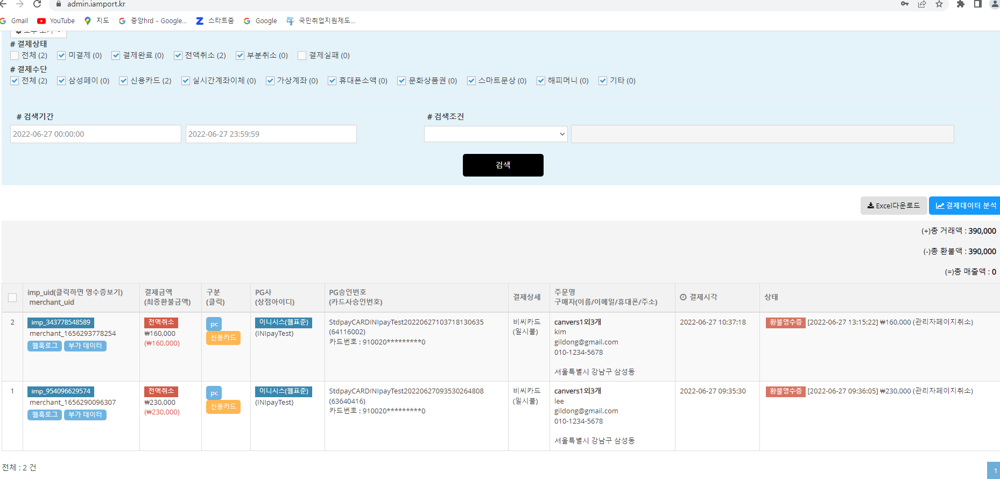

# 22.06.27 Semi-Project 프로젝트 구현 마무리

# Final **Day**

---

> 세미프로젝트 마무리
> 

# **세미프로젝트 마무리**

> 개별적 개발 내용 정리
> 

### Main화면에서 센터 Cart Icon 선택

1. 로그인과 비 로그인에 따라 별도의 경로 설정
    - 비 로그인시 Login화면이 표시
    
    - 로그인시 Cart화면 표시(Session 이용)

## 1.Cart Page **(장바구니 화면)**

1. Session의 id값의 cart 테이블의 데이터 정보들을 html 테이블 형식에 담아 나열
2. Cart안의 price값을 합산하여 Controller에 model로 담아 html화면에 전송 후 하단 Total에 보여준다
3. 테이블내의 img는 데이터베이스의 cart Table과 Product테이블을 JOIN시켜 imgname을 뽑아서 파일 위치와 연동시킨다.

## 1_1. Cart Page 기능**(회원가입 화면)**

- Input타입의 Count를 클릭할시 각각의 Total부분의 텍스트 값들과 Total 부분의 텍스트값이 각각의 값들을 합산 후 즉각적으로 나타낸다
- 페이지 내 type이 hidden인 form이 존재하며 count의 텍스트 값과 제품의 id값을 각각의 input의 value로 설정하여 타임리프를 이용해 나열시킨다.
- Proceed to Checkout버튼을 누르면 나열된 form을 List객체에 담아 controller로 보내주며, for문을 이용하여 각각 업데이트시킨다.
- Delete 버튼을 누르면 각각의 Cart id값들을 쿼리스트링으로 Controller단으로 보내 Delete기능을 실행한다.

## 2. Cart/checkout page (주문정보 입력 화면)

1. Session의 id값을 통해 여러가지 테이블을 JOIN하여 고객 정보를 나열한다.
2. DB에서 주문정보들을 받을 Form을 cust정보 옆에 보여주고 직접 입력 받도록 구성한다.
3. Cart의 내용들도 한번더 보여준다.

## 2_1. Cart/checkout page 기능(주문정보 입력 화면)

- 주문자와 수령인 동일을 체크하면 불러온 Cust정보를 주문form의 인풋 value로 일치 시킨다.
- 우편번호 찾기 버튼을 누르면 Daum 주소찾기 API를 생성시키고 주소를 입력하면 주소란의  Value를 변경시킨다.
- Confirm 버튼을 누르면 Import 결제 API가 생성된다.

## 2_2. 결제 API (iamport)

- 결제 정보에 최종 cart에 있던 데이터들의 최상단 신발의 이름과 갯수, 금액의 총합을 나타낸다.
- 최종 결제가 성공하면 현재 페이지가 담고있는 form 이 buy테이블 DB에 저장된다.
- 최종적으로 Cart에 담고있던 데이터들도 주문상세 테이블로
Controller단에서 for문을 통해 개별적으로 입력된다.
- Cart테이블의 해당 데이터도 삭제된다.

## 3. Cart/success Page (결제완료 화면)

- 결제완료가 성공하면 Success페이지로 넘어간다.
- Complete Payment띄워준다.
- 해당 주문건에 대한 주문상세정보들을 테이블에 담아 나열시켜준다.

## 3_1. 최종 결제 완료 후 Cart page

- 결제가 완료되면 해당 아이디의 카트정보들이 모두 사라진다.
- 사라진 카트페이지 구성은 이미지와같이 구성한다.

## 3_2. iamport 관리자 화면

- 실제로 iamport를 통해 결제가 서버로 넘어간걸 iamport 관리자화면에서 확인 할 수 있다.