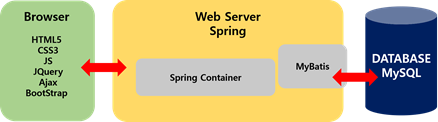
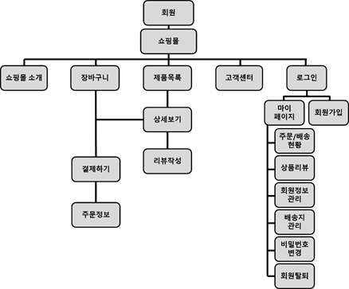

# Multi Cam 세미프로젝트

<aside>
🖐️ 2조 : 김민식, 유정아, 안원영, 서예린

</aside>

---

### 🗣️ 언어

- Java
- SQL

### 🕸️ 웹

- HTML5
- CSS3
- JS
- JQuery
- Ajax

### 🛠️ 

개발 도구

- Eclipse
- Spring
- Mybatis
- BootStrap

### 💽 DataBase

- Mysql

### 🔱 

협업도구

- Zoom
- [Github](https://github.com/minsiks/Team2-Semi_Project)
- [ERDCloud](https://www.erdcloud.com/d/tBFT5AzhSeSA2sXz7)
- [padlet](https://padlet.com/tidnjrk010/Bookmarks?utm_campaign=added_post&utm_medium=desktop&utm_source=notifications)
- [Notion](Multi%20Cam%20%E1%84%89%E1%85%A6%E1%84%86%E1%85%B5%E1%84%91%E1%85%B3%E1%84%85%E1%85%A9%E1%84%8C%E1%85%A6%E1%86%A8%E1%84%90%E1%85%B3%20fbd4e75f041a459aa02c6051ca5e67fb.md)

## 세미 프로젝트 기획안

[세미프로젝트 기획안_2조(수정).docx](Multi%20Cam%20%E1%84%89%E1%85%A6%E1%84%86%E1%85%B5%E1%84%91%E1%85%B3%E1%84%85%E1%85%A9%E1%84%8C%E1%85%A6%E1%86%A8%E1%84%90%E1%85%B3%20fbd4e75f041a459aa02c6051ca5e67fb/%EC%84%B8%EB%AF%B8%ED%94%84%EB%A1%9C%EC%A0%9D%ED%8A%B8_%EA%B8%B0%ED%9A%8D%EC%95%88_2%EC%A1%B0(%EC%88%98%EC%A0%95).docx)

- Semi-Project 시작 전 기획 및 구상

  ---

  [22.06.14 Semi-Project 브레인 스토밍](Multi%20Cam%20%E1%84%89%E1%85%A6%E1%84%86%E1%85%B5%E1%84%91%E1%85%B3%E1%84%85%E1%85%A9%E1%84%8C%E1%85%A6%E1%86%A8%E1%84%90%E1%85%B3%20fbd4e75f041a459aa02c6051ca5e67fb/22%2006%2014%20Semi-Project%20%E1%84%87%E1%85%B3%E1%84%85%E1%85%A6%E1%84%8B%E1%85%B5%E1%86%AB%20%E1%84%89%E1%85%B3%E1%84%90%E1%85%A9%E1%84%86%E1%85%B5%E1%86%BC%20fd8904be2444471796acd890d3a638d5.md)

  [22.06.15 Semi-Project 브레인 스토밍](Multi%20Cam%20%E1%84%89%E1%85%A6%E1%84%86%E1%85%B5%E1%84%91%E1%85%B3%E1%84%85%E1%85%A9%E1%84%8C%E1%85%A6%E1%86%A8%E1%84%90%E1%85%B3%20fbd4e75f041a459aa02c6051ca5e67fb/22%2006%2015%20Semi-Project%20%E1%84%87%E1%85%B3%E1%84%85%E1%85%A6%E1%84%8B%E1%85%B5%E1%86%AB%20%E1%84%89%E1%85%B3%E1%84%90%E1%85%A9%E1%84%86%E1%85%B5%E1%86%BC%200d2c23e573bb42a480c06ab8f3543dc7.md)

  [22.06.16 Semi-Project 데이터 구성](Multi%20Cam%20%E1%84%89%E1%85%A6%E1%84%86%E1%85%B5%E1%84%91%E1%85%B3%E1%84%85%E1%85%A9%E1%84%8C%E1%85%A6%E1%86%A8%E1%84%90%E1%85%B3%20fbd4e75f041a459aa02c6051ca5e67fb/22%2006%2016%20Semi-Project%20%E1%84%83%E1%85%A6%E1%84%8B%E1%85%B5%E1%84%90%E1%85%A5%20%E1%84%80%E1%85%AE%E1%84%89%E1%85%A5%E1%86%BC%203a532e6accb04209b57c7aa92cb5089c.md)

  [22.06.17 Semi-Project 기획 및 구상](Multi%20Cam%20%E1%84%89%E1%85%A6%E1%84%86%E1%85%B5%E1%84%91%E1%85%B3%E1%84%85%E1%85%A9%E1%84%8C%E1%85%A6%E1%86%A8%E1%84%90%E1%85%B3%20fbd4e75f041a459aa02c6051ca5e67fb/22%2006%2017%20Semi-Project%20%E1%84%80%E1%85%B5%E1%84%92%E1%85%AC%E1%86%A8%20%E1%84%86%E1%85%B5%E1%86%BE%20%E1%84%80%E1%85%AE%E1%84%89%E1%85%A1%E1%86%BC%20caede2b997b34984ac22af1d0446451c.md)

  [22.06.20 Semi-Project 프로젝트 구현1](Multi%20Cam%20%E1%84%89%E1%85%A6%E1%84%86%E1%85%B5%E1%84%91%E1%85%B3%E1%84%85%E1%85%A9%E1%84%8C%E1%85%A6%E1%86%A8%E1%84%90%E1%85%B3%20fbd4e75f041a459aa02c6051ca5e67fb/22%2006%2020%20Semi-Project%20%E1%84%91%E1%85%B3%E1%84%85%E1%85%A9%E1%84%8C%E1%85%A6%E1%86%A8%E1%84%90%E1%85%B3%20%E1%84%80%E1%85%AE%E1%84%92%E1%85%A7%E1%86%AB1%202faebb67ee0e41fea977969687aecfb7.md)

  [22.06.20 Semi-Project 프로젝트 구현2](Multi%20Cam%20%E1%84%89%E1%85%A6%E1%84%86%E1%85%B5%E1%84%91%E1%85%B3%E1%84%85%E1%85%A9%E1%84%8C%E1%85%A6%E1%86%A8%E1%84%90%E1%85%B3%20fbd4e75f041a459aa02c6051ca5e67fb/22%2006%2020%20Semi-Project%20%E1%84%91%E1%85%B3%E1%84%85%E1%85%A9%E1%84%8C%E1%85%A6%E1%86%A8%E1%84%90%E1%85%B3%20%E1%84%80%E1%85%AE%E1%84%92%E1%85%A7%E1%86%AB2%20238fc924fb4e4ef884b5962ed655a6ac.md)

  [22.06.21 Semi-Project 프로젝트 구현3](Multi%20Cam%20%E1%84%89%E1%85%A6%E1%84%86%E1%85%B5%E1%84%91%E1%85%B3%E1%84%85%E1%85%A9%E1%84%8C%E1%85%A6%E1%86%A8%E1%84%90%E1%85%B3%20fbd4e75f041a459aa02c6051ca5e67fb/22%2006%2021%20Semi-Project%20%E1%84%91%E1%85%B3%E1%84%85%E1%85%A9%E1%84%8C%E1%85%A6%E1%86%A8%E1%84%90%E1%85%B3%20%E1%84%80%E1%85%AE%E1%84%92%E1%85%A7%E1%86%AB3%208d7635f3da3241689db60bcadea7c173.md)

  [22.06.22 Semi-Project 프로젝트 구현4](Multi%20Cam%20%E1%84%89%E1%85%A6%E1%84%86%E1%85%B5%E1%84%91%E1%85%B3%E1%84%85%E1%85%A9%E1%84%8C%E1%85%A6%E1%86%A8%E1%84%90%E1%85%B3%20fbd4e75f041a459aa02c6051ca5e67fb/22%2006%2022%20Semi-Project%20%E1%84%91%E1%85%B3%E1%84%85%E1%85%A9%E1%84%8C%E1%85%A6%E1%86%A8%E1%84%90%E1%85%B3%20%E1%84%80%E1%85%AE%E1%84%92%E1%85%A7%E1%86%AB4%20b59c5d1cbe1b48a59ebce4da70ede1a6.md)

| 프로젝트 주제 및 개요  해결하고자 하는 문제   최종 산출물의 청사진 | [나이키 온라인 공식 쇼핑몰 홈페이지](https://www.nike.com/kr/ko_kr/w/men/fw?utm_source=Google&utm_medium=PS&utm_campaign=365DIGITAL_Google_SA_Keyword_Extend_PC&cp=53055959389_search_&gclid=Cj0KCQjwwJuVBhCAARIsAOPwGASu1zlJTEmTBCrb0N4tZXo148-2hjVf16nR0uFm1gM0p62eoXTYAuAaAn5JEALw_wcB)를  참고하여 신발 쇼핑몰을 제작한다. 체크박스를 이용한 제품 사이즈와 색상필터링 검색기능, 회원가입기능, 장바구니기능, 결제 API기능을 구현하는 것이 목표이다. |
| ------------------------------------------------------------ | ------------------------------------------------------------ |
| 프로젝트 수행 방향  수행 방법/도구                           | 1. 메뉴/기능별 세부사항   1) 구매 기능 : 무조건 카트에 넣어서 구매, 비회원구매 불가, API 활용,  결제 후 구매 정보를 확인  2) 제품 조회 기능 : 필터를 통해 특정 제품만  조회 (필터 중복체크 가능)  3) 제품 상세 페이지 : 리뷰 조회 및 리뷰  작성 가능  4) 로그인 / 회원가입 기능 : 아이디 기억, 자동로그인  5) 카트 기능 : 체크박스 활용하여 선택된  제품만 결제 가능  6) 고객센터 기능 : 이름, 이메일, 문의내용 입력 후  Add         2. 프로젝트 환경  및 도구             언어            웹            개발     도구            Data    Base            협업도구            Frame    work                  Java    SQL            **HTML5**     **CSS3**     **JS**     **JQuery**     **Ajax**    **BootStrap**            **Eclipse**                      **Mysql**            **Zoom**     **Google    Docs**    **[Github](https://github.com/minsiks/Team2-Semi_Project) [ERDCloud](https://www.erdcloud.com/d/tBFT5AzhSeSA2sXz7) [Padlet](https://padlet.com/tidnjrk010/Bookmarks) [Notion](https://hi-syl.notion.site/d9931d43fcd740328b8c45b34269994d)**            **SpringBoot**    **MyBatis**                                  3. 사이트  정보 구조도(I.A)   |